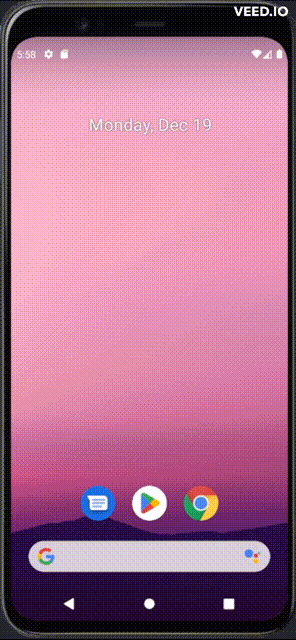

# Animation

<details>

**<summary>Application Images</summary>**



</details>

### **Code**

<ul>

#### <li>**Java files**

<ul>

<li>

<details>

**<summary>`Intro.java`</summary>**

```java
package com.example.animation;

import androidx.appcompat.app.AppCompatActivity;

import android.content.Intent;
import android.os.Bundle;
import android.view.animation.Animation;
import android.view.animation.AnimationUtils;
import android.view.animation.LayoutAnimationController;
import android.widget.TableLayout;
import android.widget.TableRow;
import android.widget.TextView;

public class Intro extends AppCompatActivity {

    @Override
    protected void onCreate(Bundle savedInstanceState) {
        super.onCreate(savedInstanceState);
        setContentView(R.layout.activity_intro);


        Animation spinin = AnimationUtils.loadAnimation(this, R.anim.custom_anim);
        LayoutAnimationController controller = new LayoutAnimationController(spinin);

        TableLayout table = findViewById(R.id.TableLayout01);

        for (int i = 0; i < table.getChildCount(); i++) {
            TableRow row = (TableRow) table.getChildAt(i);
            row.setLayoutAnimation(controller);
        }


        TextView logo1 = findViewById(R.id.TextViewTopTitle);
        Animation fade1 = AnimationUtils.loadAnimation(this, R.anim.fade_in);
        logo1.startAnimation(fade1);

        fade1.setAnimationListener(new Animation.AnimationListener() {

            @Override
            public void onAnimationEnd(Animation animation) {
                TextView logo2 = findViewById(R.id.TextViewBottomTitle);
                Animation fade2 = AnimationUtils.loadAnimation(Intro.this, R.anim.fade_in2);
                logo2.startAnimation(fade2);

                fade2.setAnimationListener(new Animation.AnimationListener() {

                    @Override
                    public void onAnimationEnd(Animation animation) {
                        startActivity(new Intent(Intro.this, MainActivity.class));
                        Intro.this.finish();
                    }


                    @Override
                    public void onAnimationStart(Animation animation) {
                    }

                    @Override
                    public void onAnimationRepeat(Animation animation) {
                    }
                });
            }


            @Override
            public void onAnimationStart(Animation animation) {

            }

            @Override
            public void onAnimationRepeat(Animation animation) {

            }
        });


    }


    @Override
    protected void onPause() {
        super.onPause();


        TextView logo1 = findViewById(R.id.TextViewTopTitle);
        logo1.clearAnimation();

        TextView logo2 = findViewById(R.id.TextViewBottomTitle);
        logo2.clearAnimation();

        TableLayout table = findViewById(R.id.TableLayout01);
        for (int i = 0; i < table.getChildCount(); i++) {
            TableRow row = (TableRow) table.getChildAt(i);
            row.clearAnimation();
        }


    }


}
```

</details>

</li>

</ul>

</li>

### <li>**XML files**

<ul>

<li>

<details>

**<summary>`AndroidManifest.xml`</summary>**

```xml
<?xml version="1.0" encoding="utf-8"?>
<manifest xmlns:android="http://schemas.android.com/apk/res/android"
    xmlns:tools="http://schemas.android.com/tools">

    <application
        android:allowBackup="true"
        android:dataExtractionRules="@xml/data_extraction_rules"
        android:fullBackupContent="@xml/backup_rules"
        android:icon="@mipmap/ic_launcher"
        android:label="@string/app_name"
        android:roundIcon="@mipmap/ic_launcher_round"
        android:supportsRtl="true"
        android:theme="@style/Theme.AppCompat.NoActionBar"
        tools:targetApi="31">
        <activity
            android:name=".MainActivity"
            android:exported="false">
            <meta-data
                android:name="android.app.lib_name"
                android:value="" />
        </activity>
        <activity
            android:name=".Intro"
            android:exported="true">
            <intent-filter>
                <action android:name="android.intent.action.MAIN" />

                <category android:name="android.intent.category.LAUNCHER" />
            </intent-filter>

            <meta-data
                android:name="android.app.lib_name"
                android:value="" />
        </activity>
    </application>

</manifest>
```

</details>

</li>


#### <li>**`anim`**

<ul>

<li>

<details>

**<summary>`fade_in.xml`</summary>**

```xml
<?xml version="1.0" encoding="utf-8"?>
<set xmlns:android="http://schemas.android.com/apk/res/android"
    android:shareInterpolator="false">


    <alpha
        android:duration="2500"
        android:fromAlpha="0.0"
        android:toAlpha="1.0" />


</set>
```

</details>

</li>

<li>

<details>

**<summary>`fade_in2.xml`</summary>**

```xml
<?xml version="1.0" encoding="utf-8"?>
<set xmlns:android="http://schemas.android.com/apk/res/android"
    android:shareInterpolator="false">


    <alpha
        android:duration="2500"
        android:fromAlpha="0.0"
        android:toAlpha="1.0" />

</set>
```

</details>

</li>

<li>

<details>

**<summary>`custom_anim.xml`</summary>**

```xml
<?xml version="1.0" encoding="utf-8"?>
<set xmlns:android="http://schemas.android.com/apk/res/android"
    android:shareInterpolator="false">


    <rotate
        android:duration="2000"
        android:fromDegrees="0"
        android:pivotX="50%"
        android:pivotY="50%"
        android:toDegrees="360" />


    <alpha
        android:duration="2000"
        android:fromAlpha="0.0"
        android:toAlpha="1.0" />


    <scale
        android:duration="2000"
        android:fromXScale=".1"
        android:fromYScale=".1"
        android:pivotX="50%"
        android:pivotY="50%"
        android:toXScale="1.0"
        android:toYScale="1.0" />


</set>
```

</details>

</li>

</ul>

</li>

#### <li>**`values`**

<ul>

<li>

<details>

**<summary>`strings.xml`</summary>**

```xml
<resources>


    <string name="app_name">Animation</string>


    <string name="help">Help Screen</string>
    <string name="menu">Main Menu Screen</string>
    <string name="settings">Settings Screen</string>
    <string name="game">Game Screen</string>
    <string name="scores">Scores Screen</string>
    <string name="app_logo_top">BEEN THERE</string>
    <string name="app_logo_bottom">DONE THAT!</string>
    <string name="app_version_info">Version 2.0.0\nCopyright © 2011 Mamlambo\nAll
    Rights Reserved.</string>


</resources>
```

</details>

</li>

<li>

<details>

**<summary>`colors.xml`</summary>**

```xml
<?xml version="1.0" encoding="utf-8"?>
<resources>


    <color name="purple_200">#FFBB86FC</color>
    <color name="purple_500">#FF6200EE</color>
    <color name="purple_700">#FF3700B3</color>
    <color name="teal_200">#FF03DAC5</color>
    <color name="teal_700">#FF018786</color>
    <color name="black">#FF000000</color>
    <color name="white">#FFFFFFFF</color>


    <color name="logo_color">#FFFF0F</color>
    <color name="version_color">#f0f0f0</color>
    <color name="version_bkgrd">#1a1a48</color>


</resources>
```

</details>

</li>

<li>

<details>

**<summary>`dimens.xml`</summary>**

```xml
<?xml version="1.0" encoding="utf-8"?>
<resources>


    <dimen name="logo_size">48sp</dimen>
    <dimen name="version_size">15sp</dimen>
    <dimen name="version_spacing">3dp</dimen>


</resources>
```

</details>

</li>

</ul>

</li>

#### <li>**`layout`**

<ul>

<li>

<details>

**<summary>`activity_intro.xml`</summary>**

```xml
<?xml version="1.0" encoding="utf-8"?>
<LinearLayout xmlns:android="http://schemas.android.com/apk/res/android"
    xmlns:app="http://schemas.android.com/apk/res-auto"
    xmlns:tools="http://schemas.android.com/tools"
    android:layout_width="match_parent"
    android:layout_height="match_parent"
    android:background="@color/black"
    android:orientation="vertical"
    tools:context=".Intro">


    <TextView
        android:id="@+id/TextViewTopTitle"
        android:layout_width="match_parent"
        android:layout_height="wrap_content"
        android:layout_gravity="center_vertical|center_horizontal"
        android:gravity="top|center"
        android:text="@string/app_logo_top"
        android:textColor="@color/logo_color"
        android:textSize="@dimen/logo_size" />


    <TableLayout
        android:id="@+id/TableLayout01"
        android:layout_width="match_parent"
        android:layout_height="wrap_content"
        android:stretchColumns="*">

        <TableRow
            android:id="@+id/TableRow01"
            android:layout_width="wrap_content"
            android:layout_height="wrap_content"
            android:layout_gravity="center_vertical|center_horizontal">

            <ImageView
                android:id="@+id/ImageView2_Left"
                android:layout_width="wrap_content"
                android:layout_height="wrap_content"
                android:layout_gravity="center_vertical|center_horizontal"
                android:src="@drawable/image1" />

            <ImageView
                android:id="@+id/ImageView2_Right"
                android:layout_width="wrap_content"
                android:layout_height="wrap_content"
                android:layout_gravity="center_vertical|center_horizontal"
                android:src="@drawable/image2" />

        </TableRow>

        <TableRow
            android:id="@+id/TableRow02"
            android:layout_width="wrap_content"
            android:layout_height="wrap_content"
            android:layout_gravity="center_vertical|center_horizontal">

            <ImageView
                android:id="@+id/ImageView3_Left"
                android:layout_width="wrap_content"
                android:layout_height="wrap_content"
                android:layout_gravity="center_vertical|center_horizontal"
                android:src="@drawable/image3" />

            <ImageView
                android:id="@+id/ImageView3_Right"
                android:layout_width="wrap_content"
                android:layout_height="wrap_content"
                android:layout_gravity="center_vertical|center_horizontal"
                android:src="@drawable/image4" />

        </TableRow>

    </TableLayout>


    <TextView
        android:id="@+id/TextViewBottomTitle"
        android:layout_width="match_parent"
        android:layout_height="wrap_content"
        android:gravity="center"
        android:text="@string/app_logo_bottom"
        android:textColor="@color/logo_color"
        android:textSize="@dimen/logo_size" />


    <TextView
        android:id="@+id/TextViewBottomVersion"
        android:layout_width="match_parent"
        android:layout_height="match_parent"
        android:layout_gravity="center_vertical|center_horizontal"
        android:background="@color/version_bkgrd"
        android:gravity="center"
        android:lineSpacingExtra="@dimen/version_spacing"
        android:text="@string/app_version_info"
        android:textColor="@color/version_color"
        android:textSize="@dimen/version_size" />


</LinearLayout>
```

</details>

</li>

<li>

<details>

**<summary>`activity_main.xml`</summary>**

```xml
<?xml version="1.0" encoding="utf-8"?>
<LinearLayout xmlns:android="http://schemas.android.com/apk/res/android"
    xmlns:app="http://schemas.android.com/apk/res-auto"
    xmlns:tools="http://schemas.android.com/tools"
    android:layout_width="match_parent"
    android:layout_height="match_parent"
    android:orientation="vertical"
    tools:context=".MainActivity">

    <TextView
        android:layout_width="match_parent"
        android:layout_height="match_parent"
        android:gravity="center"
        android:textSize="50sp"
        android:text="Perfect" />

</LinearLayout>
```

</details>

</li>

</ul>

</ul>

</li>

</ul>
